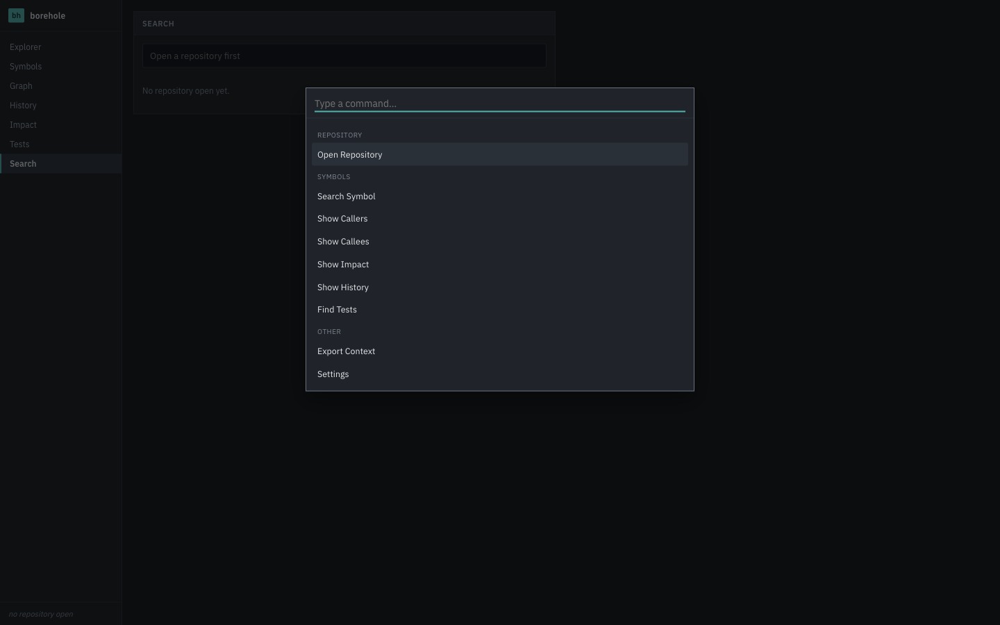
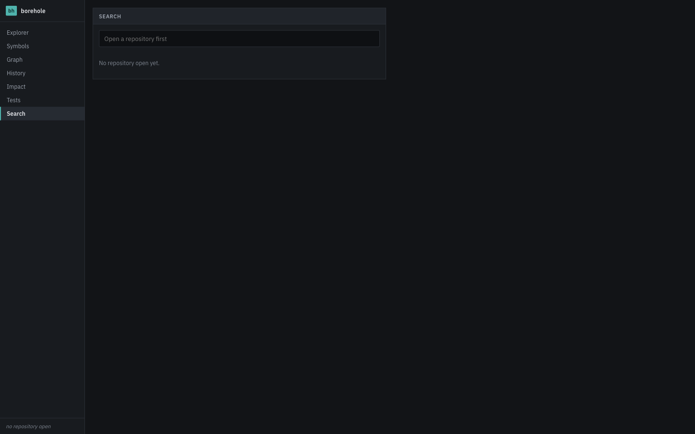

# Borehole

> Understand unfamiliar code before you change it.

[Website](https://borehole.levimackay.com) · [GitHub](https://github.com/levimackay/borehole) · [Documentation](docs/) · [License: MIT](LICENSE)

Borehole is a local-first developer tool that helps you understand a codebase you didn't write: what a piece of code does, who depends on it, what its history looks like, and what you should read before you touch it. Every answer is backed by evidence you can inspect: a citation to a reference, a commit, or a test file, never an unsupported summary.

It parses your code with [tree-sitter](https://tree-sitter.github.io/tree-sitter/), builds a symbol and dependency index in a local SQLite database, mines your Git history, and synthesizes all of it into evidence-cited reports: a symbol's blast radius, its "before you change this" reading list, its evolution over time. No account, no cloud, no telemetry. It ships as both a desktop application and a CLI, sharing one analysis engine, so scripting and exploring give you the same answers.

## The problem

You've just been handed a codebase you didn't write. Before you can safely change anything, you need to answer questions no IDE jump-to-definition fully covers: who else calls this? What tests actually cover it? Has it been rewritten three times for a reason nobody wrote down? Is this the kind of code that historically breaks something else when it changes? Today that means grepping, reading `git blame`, and guessing.

## The solution

Borehole answers those questions directly, with the receipts attached.

```
$ borehole symbol Handler
class   Handler          billing/handler.ts:1
class   Handler          shipping/handler.ts:1
method  Handler.process  billing/handler.ts:2
method  Handler.process  shipping/handler.ts:2
```

Two unrelated classes happen to share a name. Borehole's reference resolver refuses to guess which one a call site meant. It reports the reference as unresolved at low confidence rather than silently attributing it to one of them. That honesty is the whole design philosophy: every relationship the engine reports carries a `high`/`medium`/`low` confidence, and "insufficient evidence" is always a valid answer.

```
$ borehole impact top --before
BEFORE YOU CHANGE THIS: top

Understand first:
  1. middle: this depends on it

BLAST RADIUS: top

Direct callers:   0
Indirect callers: 0
Test suites:      0
Public API:       yes
Config files:     0

Risk: LOW
Confidence: high
```

That's a real run against one of the repository's own test fixtures (`fixtures/nested-deps`), not a mockup.

## See it in action

<p align="center">
  
</p>

<p align="center">
  
</p>

The desktop shell above is the real, running application: a Cmd/Ctrl+K command palette and a seven-view layout (Explorer, Symbols, Graph, History, Impact, Tests, Search) built on Tauri 2 and React. Its analysis engine is complete and tested end-to-end via the CLI (see the sessions above); wiring live desktop screenshots of populated analysis views is the next visual pass. See [Roadmap](#roadmap).

## Features

### Code intelligence

Symbol extraction across Rust, TypeScript/TSX, JavaScript, Python, and Go via tree-sitter: functions, methods, classes, interfaces, structs, enums, traits, imports, and more, each with a qualified name, signature, doc comment, and exported-ness.

### Dependency & call graph

Interactive, evidence-backed graphs of who calls what. Every node and edge corresponds to a real, resolved reference, never a decorative connection. Bounded-depth traversal that's cycle-safe on recursive/circular code.

### Blast radius

Select a symbol; see its direct and indirect callers, test coverage, public-API status, and a risk tier (`low`/`medium`/`high`/`critical`) with the specific reasons behind it: never a bare "this will break," always "these areas may be affected, and here's why."

### Before you change this

A generated reading list (the callers, dependencies, and tests worth understanding first), plus historical warnings when Git history shows the code has been heavily reworked before.

### Git archaeology

File and (best-effort) symbol-level history via `git2`/libgit2: never a shell-out to the `git` binary, so a malicious repository can't inject a command through a crafted branch name or commit message. Rename-following history, temporal coupling (files that change together, presented as correlation, not causation), and an honest confidence signal whenever line-tracking has to fall back to whole-file attribution.

### Test discovery

Naming-convention, directory-convention, and confirmed-import heuristics find a symbol's related tests, clearly labeled as *related tests*, never as a measured coverage percentage Borehole doesn't have.

### Evidence, everywhere

Every report field that isn't a raw count cites what produced it: a reference site, a commit, a test file. If the evidence isn't there, the report says so instead of inventing a plausible-sounding summary.

### Context export

`--json` on every CLI command for scripting, code review, or feeding an AI coding assistant real, evidence-backed context about the code it's about to touch.

## Installation

Pre-built desktop binaries are published on [GitHub Releases](https://github.com/levimackay/borehole/releases) once a version is tagged (macOS, Windows, Linux; see [Release signing](docs/RELEASE-SIGNING.md) for the current, unsigned-by-default state).

Build from source:

```sh
git clone https://github.com/levimackay/borehole.git
cd borehole
npm install
cargo build --release -p borehole      # CLI binary at target/release/borehole
npm run tauri build                    # desktop app bundle
```

Requires Rust (stable) and Node.js 20+. See [CONTRIBUTING.md](CONTRIBUTING.md) for the full development setup, including Tauri's platform prerequisites.

## CLI

```
borehole analyze <path>                 # index (or re-index) a repository
borehole symbol <name> [repo]           # search for a symbol
borehole callers <symbol> [repo]        # who calls it
borehole callees <symbol> [repo]        # what it calls
borehole impact <target> [repo]         # blast radius
borehole impact <target> [repo] --before # + the "before you change this" reading list
borehole history <target> [repo]        # Git evolution
borehole tests <symbol> [repo]          # related tests
borehole explain <target> [repo]        # full evidence-backed profile
```

Every subcommand accepts `--json` for machine-readable output.

## Architecture

```mermaid
flowchart TB
    core["engine-core<br/>repo access · config · ignore rules"]
    parse["engine-parse<br/>tree-sitter extraction"]
    index["engine-index<br/>SQLite · reference resolution"]
    graph["engine-graph<br/>traversal algorithms"]
    git["engine-git<br/>git2 history mining"]
    evidence["engine-evidence<br/>blast radius · before-you-change-this"]
    cli["cli<br/>borehole binary"]
    tauri["src-tauri<br/>desktop IPC layer"]
    react["React / TypeScript UI"]

    core --> parse --> index --> graph
    core --> git
    index --> evidence
    graph --> evidence
    git --> evidence
    evidence --> cli
    evidence --> tauri --> react
```

A Cargo workspace of small, single-direction crates. `engine-core` depends on nothing else in the workspace; `engine-git` reads `.git` independently of the parse/index pipeline; `cli` and `src-tauri` both depend on `engine-evidence` and nothing lower, which is what guarantees the desktop app and the CLI produce identical answers to the same question: they're calling the same functions, not two reimplementations. Full details, including the reference-resolution algorithm and SQLite schema, are in [docs/ARCHITECTURE.md](docs/ARCHITECTURE.md).

## The evidence model

Most of what Borehole reports isn't computed by a compiler or type checker: it's resolved by name-and-import-scope heuristics and by intersecting Git diff hunks with symbol spans, because full semantic resolution per language is a language-server-scale project on its own (a deliberate scope decision, not an oversight). That means every relationship carries an explicit confidence tag, and the resolver would rather say "I don't know" than guess:

```
$ borehole symbol Handler   # two unrelated classes share this name
class   Handler          billing/handler.ts:1
class   Handler          shipping/handler.ts:1
```

A call site that could plausibly mean either one resolves to *neither* (`to_symbol: None` at low confidence) rather than being silently attributed to one of them. This is enforced by an integration test against a fixture built specifically to catch a resolver that guesses.

## Supported languages

**v1 (full symbol extraction + reference resolution):** Rust, TypeScript, TSX, JavaScript, Python, Go.

Adding a language is a four-step, documented path (new `Language` variant, grammar dependency, one `LanguageExtractor` implementation, wire it into the dispatch table). Nothing in indexing, graphing, git analysis, or evidence synthesis needs to change, since they're all language-agnostic by construction. See [docs/ARCHITECTURE.md § Adding a language](docs/ARCHITECTURE.md#adding-a-language).

## Privacy

No account. No cloud backend. No telemetry. Borehole reads only the repository you explicitly open, plus its local `.git` directory (read-only: no fetches, no writes). By default it makes zero network requests. Full model: [PRIVACY.md](PRIVACY.md).

## Security

Repository content is treated as untrusted input, the same way a browser treats a downloaded file. Borehole never executes anything found in a repository: no package scripts, no build scripts, no Git hooks. All Git access goes through `git2`/libgit2 rather than shelling out, closing off command injection via crafted branch names or commit messages. Every path derived from repository content is validated against the opened repository's root before touching the filesystem. Adversarial input handling (deeply nested files, huge histories) has been through an internal security review. See [SECURITY.md](SECURITY.md) for the full threat model and how to report a vulnerability.

## Performance

Indexing walks files in parallel and reports incremental progress; re-indexing skips any file whose content hash hasn't changed. Graph traversal is depth-bounded and cycle-safe. Git history queries accept a configurable commit limit. Parsing itself is time-boxed per file, so a single adversarial or pathological file degrades to a clean per-file error instead of stalling the whole indexing run.

## Roadmap

- Populate desktop screenshots with a live, indexed repository (the analysis engine and IPC layer are complete; this is a visual-QA pass, not new engineering).
- Optional AI explanation layer (provider-agnostic, off by default, clearly labeled as AI-generated vs. repository evidence; see `docs/ARCHITECTURE.md`'s AI layer section).
- Java, C#, Swift language support.
- Signed, notarized release builds (see [docs/RELEASE-SIGNING.md](docs/RELEASE-SIGNING.md) for exactly what's needed).
- Force-directed graph layout (the current dependency graph view uses a simpler tiered layout).

## Contributing

See [CONTRIBUTING.md](CONTRIBUTING.md) for development setup, architecture orientation, and testing conventions. Please read [CODE_OF_CONDUCT.md](CODE_OF_CONDUCT.md).

## Development

```sh
fixtures/build-fixtures.sh   # materialize the fixture repos used by integration tests
cargo test --workspace       # 98 tests across the engine crates
npm run build                # frontend typecheck + build
cargo fmt --all && cargo clippy --workspace --all-targets -- -D warnings
```

## License

[MIT](LICENSE). Third-party dependency licenses: [THIRD-PARTY-NOTICES.md](THIRD-PARTY-NOTICES.md).

---

Development of this project includes AI-assisted software engineering using Claude Code. All code is reviewed, tested, and maintained by the project author.
